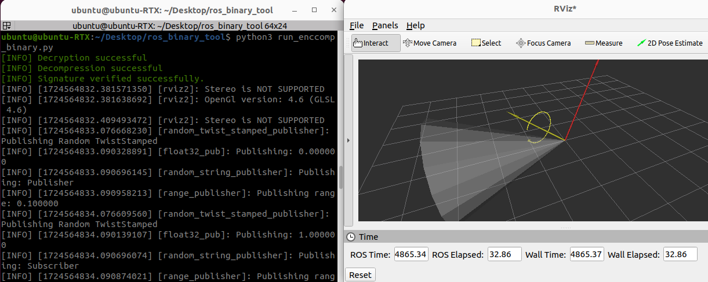

# ros_binary_tool

This package is ROS Binary Tool for Signature verification and Encription.

## Features
### 1. Tamper Detection via Signature Verification

Verify the integrity of binary data through cryptographic signature verification. This ensures that the data has not been altered since it was signed.

### 2. Encryption for Data Security

Encrypt binary data to ensure confidentiality and secure transmission. Utilizes RSA encryption to protect data from unauthorized access.

### 3. Compression for Efficient Storage

Compress binary data to reduce its size for efficient storage and transmission. Uses zlib compression to minimize data footprint.




## Usage of Signature Verification

```sh: Terminal
python3 combine_binary.py
```

```sh: Terminal
python3 run_binary.py
```

## Usage of Signature Verification and Encription

```sh: Terminal
python3 combine_enc_binary.py
```

```sh: Terminal
python3 run_enc_binary.py
```

## Usage of Signature Verification and Encrypted Compressed

```sh: Terminal
python3 combine_enccomp_binary.py
```

```sh: Terminal
python3 run_enccomp_binary.py
```

## Folder Structure

The project directory is organized as follows:

- **`binary/`**
  This folder contains the binary files to be combined as input.

- **`logs/`**
  This folder stores the log files generated by the logger.

- **`output/`**
  This folder contains the output files generated after combining the binaries. The following files are created:
  - `private_key.pem`: The private key for encryption.
  - `public_key.pem`: The public key for encryption.
  - `signature.bin`: The digital signature for the combined data.
  - `output_binary.bin`: The combined binary output file.

- **`shellscript/`**
  This folder contains files used for data transfer.

## License
This repository is licensed under the MIT license, see LICENSE.
